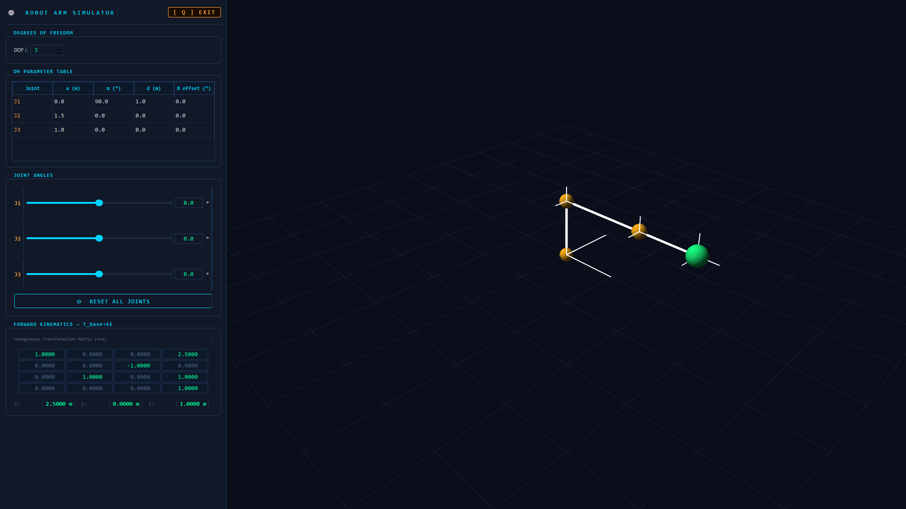

# 🤖 Robot Arm Simulator

A real-time **3D robot arm simulator** built with Python, featuring Denavit-Hartenberg (DH) parameter control, forward kinematics visualization, and an interactive dark-themed GUI.

<p align="center">
  
</p>

---

## ✨ Features

- **1 to 6 DOF** configurable robot arm
- **Editable DH parameter table** (a, α, d, θ offset per joint)
- **Real-time Forward Kinematics** — 4×4 homogeneous transformation matrix updates live
- **Joint sliders + angle input** for each joint (−180° to +180°)
- **One-click Reset** for all joints
- **3D OpenGL viewport** with joint frame axes (X/Y/Z), colored links, and EE marker
- **Full-screen** dark interface

---

## 🚀 Run from Source

### 1. Install Dependencies

```bash
pip install PyQt5 pyqtgraph PyOpenGL PyOpenGL_accelerate numpy
```

### 2. Run

```bash
python robot_arm_sim.py
```

> Press **`Q`** or click the **`[ Q ] EXIT`** button to close.

---

## 📦 Download as Standalone Executable (No Python Required)

A pre-built `.exe` (Windows) or binary (Linux/macOS) lets anyone run the simulator without installing Python or any libraries.

### ⬇️ [Download Latest Release](../../releases/latest)

### 🔧 How to Build It Yourself

If you want to create the standalone executable from source:

**1. Install PyInstaller:**
```bash
pip install pyinstaller
```

**2. Build the executable:**
```bash
pyinstaller --onefile --windowed --name RobotArmSim robot_arm_sim.py
```

**3. Find your binary:**
```
dist/
└── RobotArmSim.exe       ← Windows
└── RobotArmSim           ← Linux / macOS
```

> **Note:** Run the build on the **same OS** you want to deploy on. PyInstaller does not cross-compile.  
> On Linux you may need: `pip install pyinstaller` inside a virtual environment.  
> On macOS, add `--windowed` to suppress the terminal window.

---

## 📚 Libraries Used

| Library | Purpose |
|---|---|
| `PyQt5` | GUI framework — windows, widgets, sliders, tables |
| `pyqtgraph` | Real-time 3D OpenGL viewport (`GLViewWidget`) |
| `PyOpenGL` | OpenGL backend for 3D rendering |
| `numpy` | Matrix math — DH transforms, FK chain |

---

## 📐 Core Formulas

### Denavit-Hartenberg Transformation Matrix

Each joint contributes one 4×4 homogeneous transform:

$$
^{i-1}T_i =
\begin{bmatrix}
\cos\theta_i & -\sin\theta_i\cos\alpha_i &  \sin\theta_i\sin\alpha_i & a_i\cos\theta_i \\
\sin\theta_i &  \cos\theta_i\cos\alpha_i & -\cos\theta_i\sin\alpha_i & a_i\sin\theta_i \\
0            &  \sin\alpha_i             &  \cos\alpha_i             & d_i             \\
0            &  0                        &  0                        & 1
\end{bmatrix}
$$

**DH Parameters:**

| Symbol | Meaning |
|---|---|
| `a`  | Link length — distance along Xᵢ from Zᵢ₋₁ to Zᵢ |
| `α`  | Link twist — angle between Zᵢ₋₁ and Zᵢ around Xᵢ |
| `d`  | Joint offset — distance along Zᵢ₋₁ from Xᵢ₋₁ to Xᵢ |
| `θ`  | Joint angle — rotation around Zᵢ₋₁ (the actuated variable) |

### Forward Kinematics Chain

The base-to-end-effector transform is the product of all joint transforms:

$$
T_{base}^{EE} = T_0^1 \cdot T_1^2 \cdot T_2^3 \cdots T_{n-1}^{n}
$$

The **end-effector position** is extracted from the last column:

$$
\vec{p}_{EE} = \begin{bmatrix} T_{03} \\ T_{13} \\ T_{23} \end{bmatrix}
$$

---

## 🖥️ Controls

| Action | Control |
|---|---|
| Rotate 3D view | Left-click drag |
| Pan 3D view | Middle-click drag |
| Zoom | Scroll wheel |
| Reset all joints | `⟳ RESET ALL JOINTS` button |
| Exit | `[ Q ] EXIT` button or press `Q` |

---

## 📁 Project Structure

```
robot_arm_sim.py      ← Main application (single file)
README.md             ← This file
```

---

## 📄 License

MIT License — free to use, modify, and distribute.
